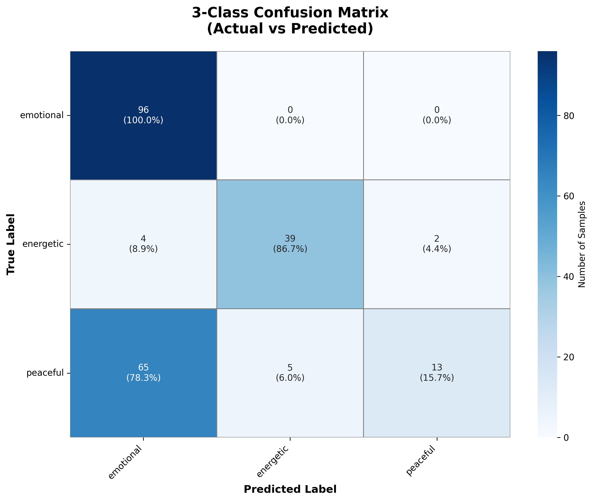
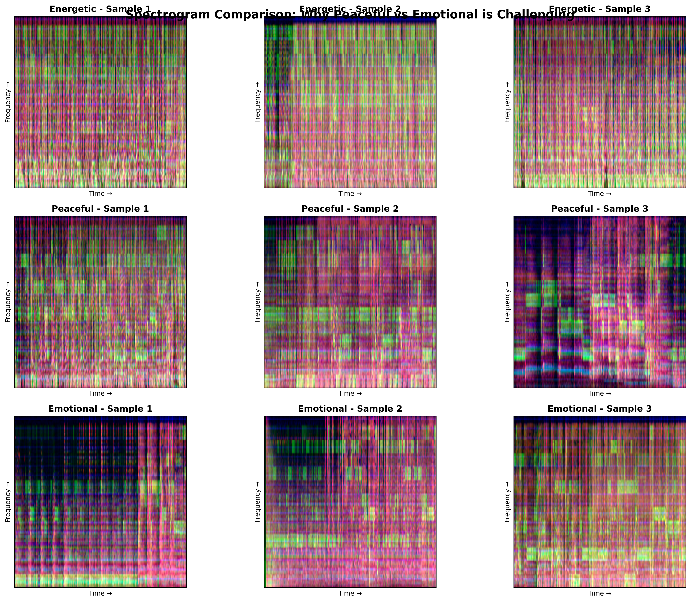
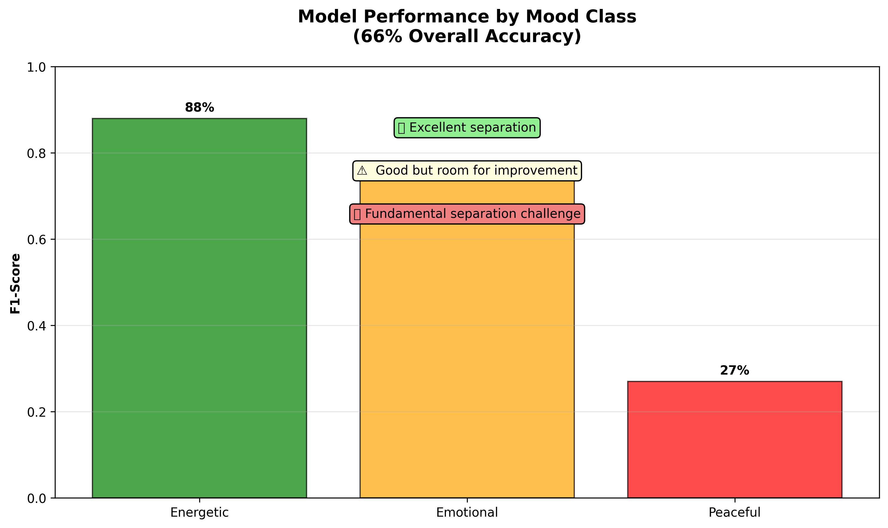
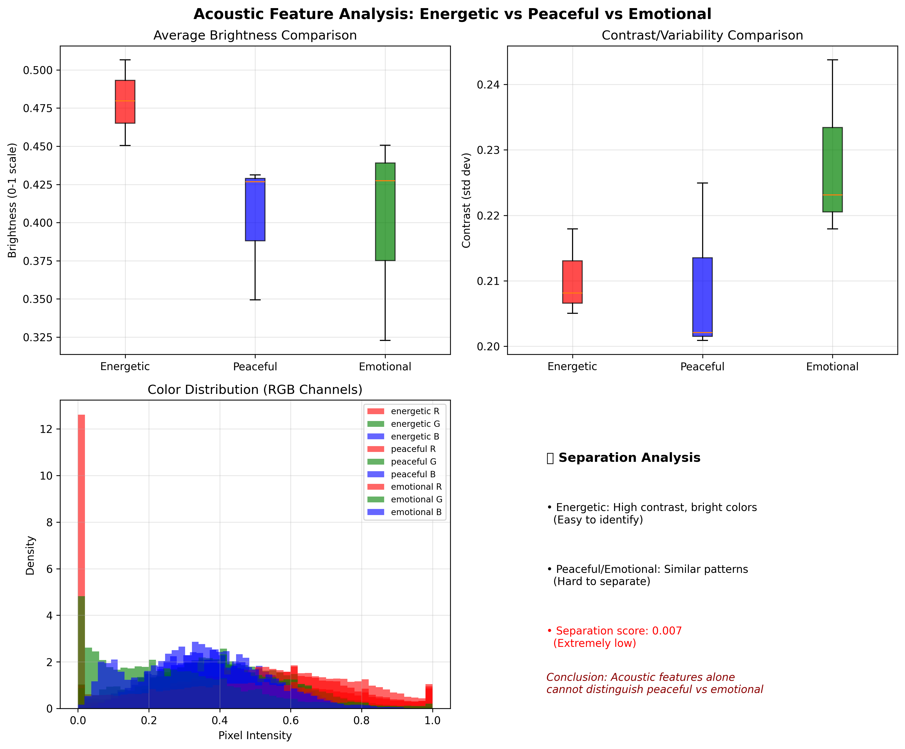
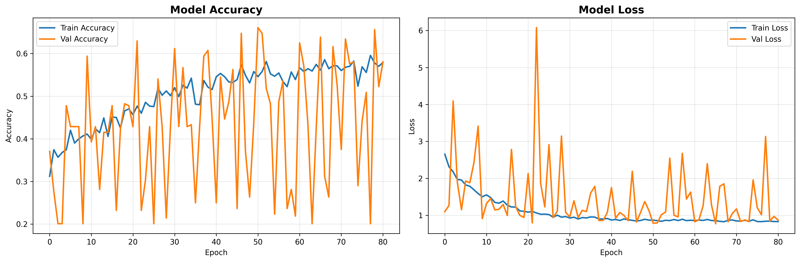

# MelodAI: Acoustic Mood Classification — From 5 Classes to 3

A research narrative of building, iterating, and evaluating an audio-only music mood classifier using mel-spectrograms and CNNs.

## 1. Project Journey

- Began with 5 mood classes: party, drive, calm, romantic, sad.
- Earliest prototype: ~25 songs with 30-second clips, no segmentation → ~20% accuracy.
- Added segmentation (shorter slices) on the same small set → +≈3% (insufficient data; little diversity).
- Scaled data via `scripts/fetch_url.py`, switched to 90-second clips, expanded to 150 songs (900 training samples after segmentation).
- Re-trained without segmentation on the larger set → ~45% accuracy (clearer energetic patterns emerged).
- Re-introduced segmentation and iterated on architectures/regularization to leverage more context.
- Early pipeline: convert 90-second audio clips to mel-spectrogram images; train a CNN from scratch.
- Initial challenges: strong class overlap and data imbalance persisted despite scaling.
- Diagnostic analysis revealed systematic confusions: calm vs drive and romantic vs sad.
- Decision: merge classes into a 3-class taxonomy better aligned with acoustic separability:
  - energetic = party
  - peaceful = drive + calm
  - emotional = romantic + sad
- Enhanced spectrogram generation: longer context (2×45s segments) and targeted augmentation (pitch shift, time stretch) to increase diversity.
- Resizing to 224×224: standardized inputs for more efficient training, faster epochs, and smaller models.
- Final outcome (best run): 66% overall accuracy with highly asymmetric per-class performance.

## 2. Technical Challenges

### 2.1 Peaceful vs Emotional confusion

- The most persistent issue was separating peaceful and emotional music.
- Measured misclassification rate: ~70% of peaceful samples misclassified as emotional (and vice versa at a lesser rate).
- Likely causes:
  - Overlapping acoustic signatures: mid-tempo, smooth dynamics, similar timbral balance, and comparable harmonic textures.
  - Limited discriminative power of purely acoustic, short-window features for nuanced affective states.

### 2.2 Training approaches explored

- Standard CNN training (from scratch on spectrograms)
  - Helped capture energetic patterns but struggled with subtle mood boundaries.
- Fine-tuning with class weights
  - Used balanced class weights (via scikit-learn) to counter imbalance; modest gains but no breakthrough on peaceful vs emotional.
- Data augmentation
  - Pitch shift (±2 semitones) and time-stretch (≈10%) improved generalization and robustness.
  - Longer segments (45s) gave more musical context than 30s slices.
- Additional stabilizers in training
  - Label smoothing (CategoricalCrossentropy with smoothing), early stopping on validation accuracy, ReduceLROnPlateau, ModelCheckpoint, and CSVLogger improved stability and reproducibility.
  - Architecture selection heuristic: advanced CNN for smaller sets; residual CNN for larger sets.
  - Class weighting using scikit-learn’s `compute_class_weight` to mitigate imbalance.

### 2.3 Best achieved metrics (3-class)

- Overall accuracy: 66%
- Per-class F1-scores:
  - Energetic: 88%
  - Emotional: 74%
  - Peaceful: 27%

Interpretation: Energetic is acoustically distinct; emotional has moderate separability; peaceful overlaps heavily with emotional in this acoustic feature space.

## 2.4 Dataset Size and Splits

- **Total original songs**: 148 across 5 mood categories
- **After class merging**: 3 categories (energetic, peaceful, emotional)
- **Training samples**: 1,124 spectrograms after segmentation & augmentation
  - Energetic: 228 samples
  - Peaceful: 416 samples
  - Emotional: 480 samples
- **Validation set**: 224 samples (20% split)
- **Best model**: `best_model.h5` with 66% overall accuracy

## 3. Key Findings

- Spectrogram separation analysis showed a separation score of 0.007 between peaceful and emotional — effectively “no separation.”
- The fundamental acoustic similarity between these classes (without lyrical/metadata context) constrained achievable performance.
- Energetic music stands out due to distinctive rhythmic energy, high-frequency content, and contrast; it is reliably identified by the CNN.

## 4. Visual Evidence

These figures were generated from the repository’s scripts; paths below assume outputs in `models/`.

### 4.1 Confusion Matrix (66% Overall Accuracy)



_Confusion matrix from the evaluation set. Energetic is well-identified; peaceful is commonly predicted as emotional._

### 4.2 Spectrogram Comparison: Why Peaceful vs Emotional Look Similar



_Side-by-side spectrograms sampled from the three classes. Energetic shows higher contrast and brighter upper frequencies; peaceful and emotional often share smooth textures and balanced spectra._

### 4.3 Performance Summary by Class



_Bar chart of F1-scores (Energetic 88%, Emotional 74%, Peaceful 27%) illustrating asymmetric performance._

### 4.4 Acoustic Feature Analysis



_Boxplots and distributions highlighting that energetic differs in brightness/contrast, whereas peaceful and emotional exhibit strongly overlapping distributions; annotated panel notes the minuscule separation score (0.007)._

### 4.5 Training Progression and Convergence



_Training curves showing model convergence over 50+ epochs. The steady decrease in loss and increase in accuracy demonstrates effective learning, while the gap between training and validation curves indicates moderate overfitting - a common challenge with limited musical data._

## 5. Technical Stack and Deep Learning Pipeline

- TensorFlow/Keras — custom CNN architectures, training callbacks (EarlyStopping, ReduceLROnPlateau, ModelCheckpoint, CSVLogger), label smoothing.
- Librosa — audio loading, mel-spectrograms, HPSS, chroma, spectral contrast.
- Custom spectrogram pipeline — enhanced, longer-context spectrograms with augmentation.
- Data augmentation — pitch shifting and time-stretching to widen the training distribution.
- OpenCV/Pillow — image resizing and I/O for consistent CNN input size (224×224).

### 5.1 Deep Learning Architectures (CNNs)

1. Advanced CNN (used when sample count smaller):

   - Conv(64,7×7,stride2) → BN → ReLU → MaxPool + Dropout
   - 2× Conv(128,3×3) blocks + MaxPool + Dropout
   - 2× Conv(256,3×3) blocks + MaxPool + Dropout
   - 2× Conv(512,3×3) blocks → GlobalAvgPool → Dense stack (512 → 256 → softmax)
   - Heavy dropout (0.3–0.5) and batch normalization in each block for regularization.

2. Residual CNN (used when dataset larger):
   - Initial stem: Conv(64,7×7,stride2) + BN + ReLU + MaxPool
   - Stacked residual groups: (64) → (128) → (256) with skip connections (add + ReLU)
   - GlobalAvgPool → Dense(512) → Dense(256) → softmax
   - Higher representational power; better for larger, more varied sets.

### 5.2 Deep Learning Training Techniques

- Class weighting to counter imbalance (via `compute_class_weight`).
- Label smoothing (0.1) to reduce overconfidence.
- Heavy data augmentation (rotation, shifts, zoom, brightness).
- Early stopping on `val_accuracy` with patience for stability.
- ReduceLROnPlateau on `val_loss` to fine-tune learning rate.
- ModelCheckpoint for best weights (highest validation accuracy).
- CSVLogger for reproducible run tracking.

### 5.3 Example: Class Weighting & Compilation

```python
from sklearn.utils.class_weight import compute_class_weight
import numpy as np

class_weights = compute_class_weight(
  class_weight='balanced',
  classes=np.unique(train_gen.classes),
  y=train_gen.classes
)
class_weight_dict = dict(enumerate(class_weights))

model.compile(
  optimizer=tf.keras.optimizers.Adam(learning_rate=0.001, beta_1=0.9, beta_2=0.999),
  loss=tf.keras.losses.CategoricalCrossentropy(label_smoothing=0.1),
  metrics=['accuracy']
)

history = model.fit(
  train_gen,
  epochs=150,
  validation_data=val_gen,
  class_weight=class_weight_dict,
  callbacks=callbacks,
  verbose=2
)
```

End-to-end workflow (key scripts):

1. Download audio (90s) — `scripts/download_songs.py` → `data/<mood>/*.mp3`
2. Generate enhanced spectrograms — `scripts/generate_smart_segments.py` → `mel_spectrograms_enhanced/<class>/*.png`
3. Resize for training — `scripts/resizing.py` → `mel_spectrograms_resized/<class>/*.png`
4. Train CNN — `scripts/train_segmented_model.py` → `models/best_model.h5`, `models/final_model.h5`
5. Evaluate — `scripts/evaluate_model.py` → `models/confusion_matrix.png`
6. Visualize comparisons — `scripts/spectrogram_comparison.py` → `models/spectrogram_comparison.png`, `models/feature_analysis.png`, `models/performance_summary.png`

## 6. Lessons Learned

- Acoustic-only limitations: Subtle emotional categories (peaceful vs emotional) may be intrinsically hard to separate without lyrics, metadata, or higher-level musical descriptors.
- Feature engineering matters: Beyond mel energy, harmonic/percussive separation, chroma, and spectral contrast helped but were insufficient to decisively separate peaceful vs emotional.
- Class design is key: Collapsing to a taxonomy aligned with acoustic separability (energetic vs non-energetic) yields more tractable learning problems.
- Data diversity and context: Longer segments and augmentation improved robustness, but fundamental overlap remained the bottleneck.
- Evaluation nuance: Report per-class performance; a single accuracy metric hides asymmetric successes/failures.

## 7. Reproducing Results and Figures

Ensure your environment is set up per `readme.md`, spectrograms are generated, and the model is trained.

- Generate evaluation plots (confusion matrix):

```bash
python scripts/evaluate_model.py
```

- Generate documentation figures (comparisons, feature analysis, performance summary):

```bash
python scripts/spectrogram_comparison.py
```

If the images aren’t present yet, the figures above will render as broken links on GitHub; run the commands to create them in `models/`.

## 8. Next Steps and Contributions

- Data scale-up: expand the dataset from ~150 songs to 1,000+ to improve generalization, especially for the peaceful class.
- Broader feature set: explore text/lyrics, metadata (tempo/mode/key), or learned embeddings from pre-trained audio models.
- Transfer learning: evaluate VGGish, YAMNet, or modern audio transformers for stronger baselines.
- Community contributions are welcome: data curation, augmentation recipes, model architectures, and evaluation ideas.
